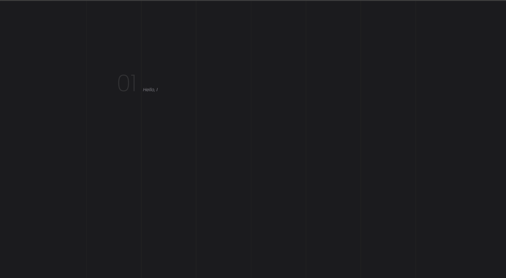

# Felipe dos Anjos - Personal Portfolio

> This repo includes code for my personal portfolio, developed as part of Microverse's Full Stack Development Program.
> The design is based on 




### Check it online!
[Live preview](felipe-anjos.surge.sh)

## Built With
- Gatsby
- React

## Getting Started

To get a local copy up and running clone this repository to your
computer.

### Prerequisites

Gatsby: >=2.2

### Usage

Start server with:

```
  gatsby develop
```

Open `http://localhost:8000/` in your browser.

### Build static website

```
  gatsby build
```

## Author

👤Felipe dos Anjos

- Github: [@githubhandle](https://github.com/fc-anjos)
- Linkedin: [linkedin](https://linkedin.com/in/fc-anjos)

## Show your support

Give a ⭐️ if you like this project!

## 🤝 Acknowledgments
Design inspired by Microverse's suggetions templates
